# 简要介绍

在谷歌搜索接码平台，找到了jiemadi.com这个网址

界面简洁，而且免费

但实际上，这个网站**不提供任何服务**，其目的只是骗取点击、发布广告、诱导用户使用百度网盘、迅雷、悟空浏览器等软件获利

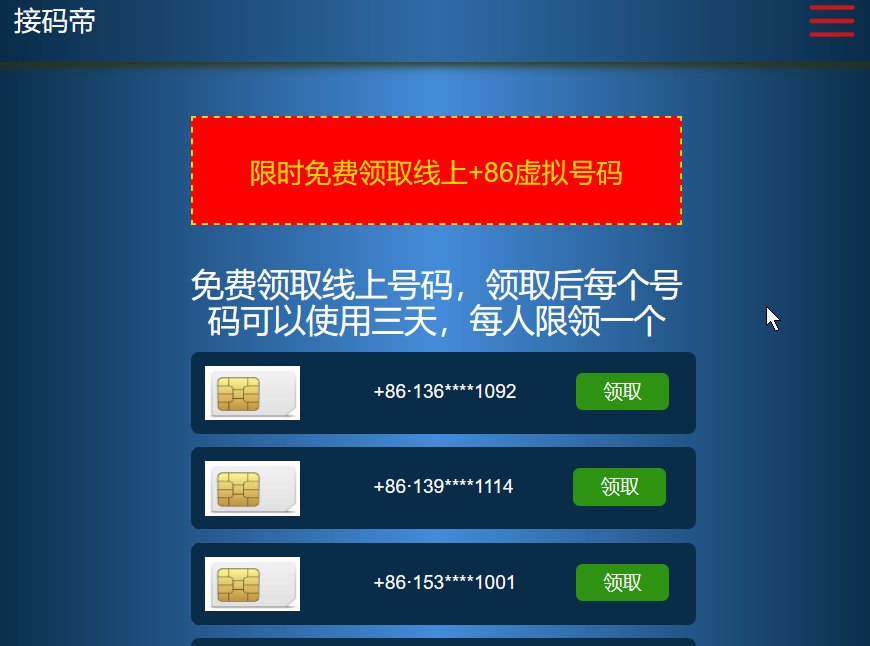

该网站声称提供**接码服务**和**免费虚拟号码**

实际上，所有服务都不存在，用户按照指示后完成任务后，网站不会给与“VIP号码激活码”，而会弹出google广告，或“次数已达上限”提示，欺骗用户次日继续点击

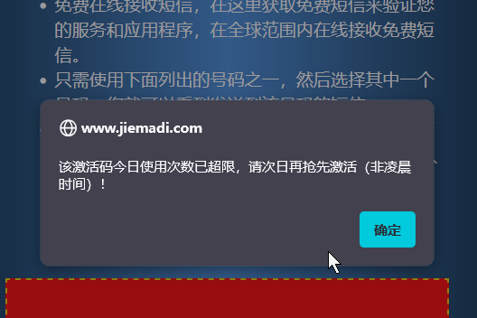


总流程图

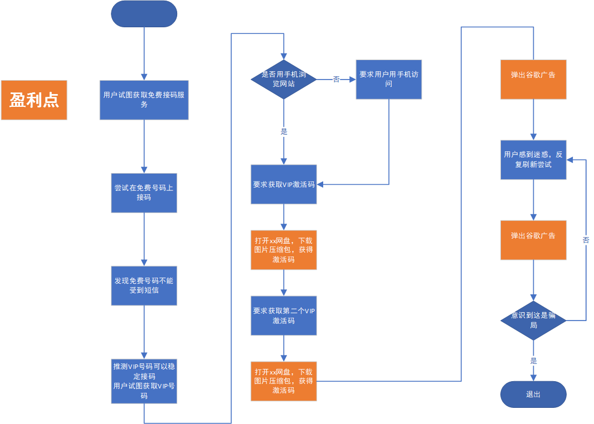


# 骗局具体实现

## 阶段1 用户试图获取免费接码服务

用户当然希望白嫖服务，

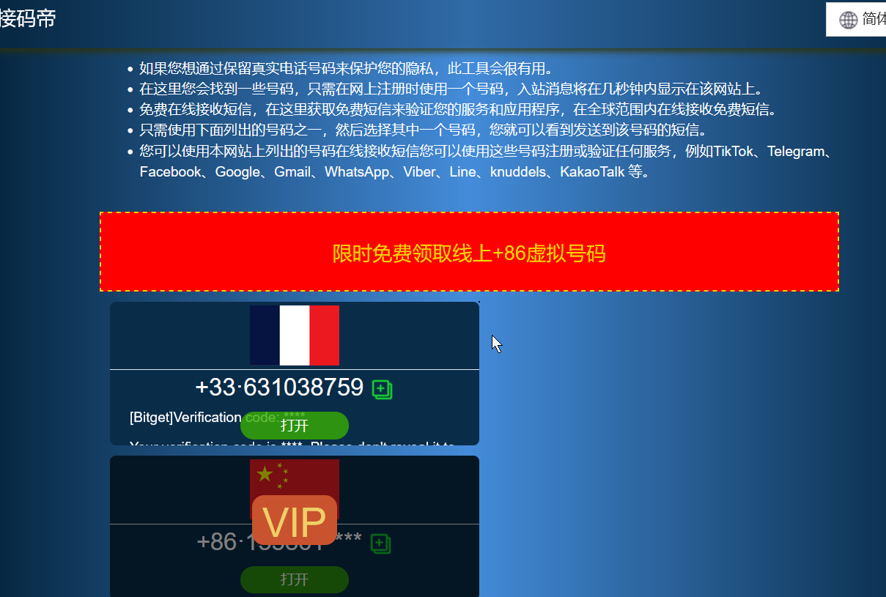


点击一个免费号码，打开，看起来这个号码似乎生效

但是尝试接收验证码后，反复刷新发现没有结果

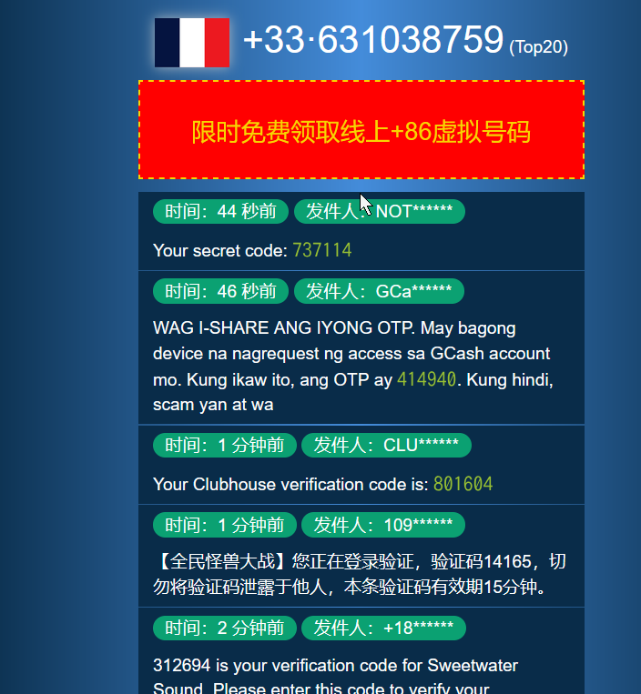

于是用户怀疑是否使用VIP号码可以得到正常服务，或寻求专属号码

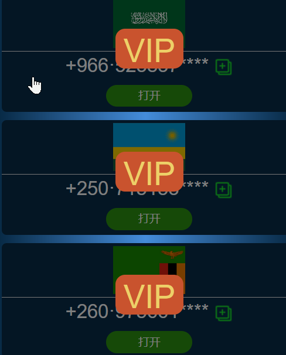


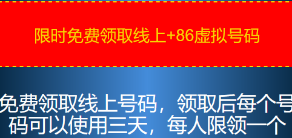

## 阶段2 用户试图获取VIP号码

点击VIP号码后，会有如下弹窗，要求用户获取VIP激活码，

点击获取VIP激活码按钮后，会触发`goPan(element)`函数，为防止用户用F12发现猫腻，网站会先检测用户设备，弹窗要求用户使用手机，这样就很难查看js脚本

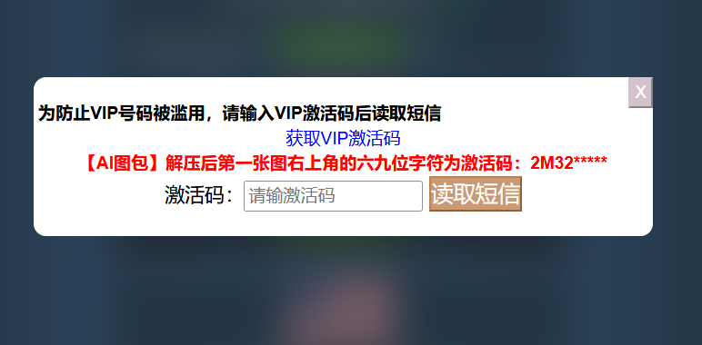

```js
//goPan函数检测设备片段
//检测用户设备
let userAgent = navigator.userAgent;
let isMobile = /Android|webOS|iPhone|iPad|iPod|BlackBerry|IEMobile|Opera Mini/i.test(userAgent);
let wheel = localStorage.getItem('wheel');
if (isMobile && !wheel) {...}    
else {
    //如果不是手机就会弹出警告
    alert('请使用手机浏览器领取！');
}

```


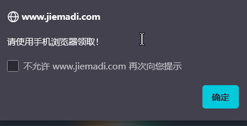

整个过程有2步，每一步要求用户下载一个图片压缩包，以获取“激活码”

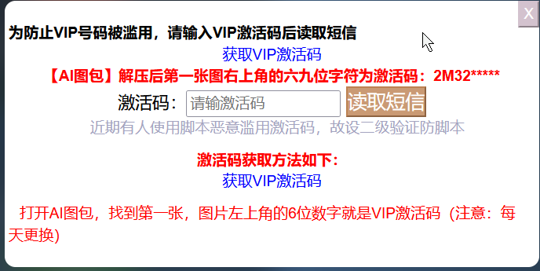

用户跳转网盘界面，下载压缩包

比如这个压缩包，第一张图的左上角的`xkkkxx`就是激活码

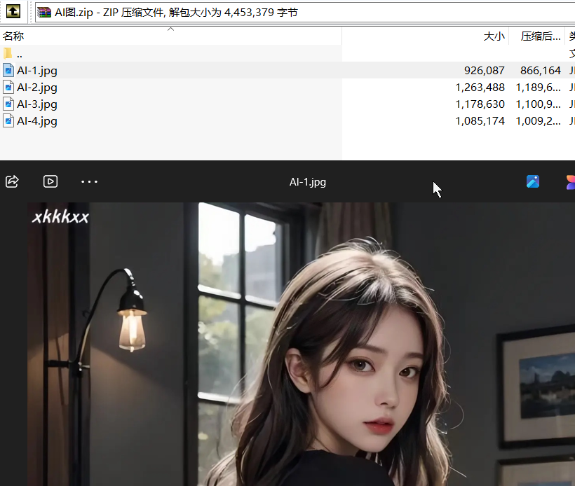

跳转代码如下

```js
if (isMobile && !wheel) {...
		
        if (nameValue == 1) {
        	//从迅雷下载
            window.open('https://pan.xunlei.com/s/VOU5gOBHEjxtJcybWAlyxUZiA1?pwd=qgxz', '_blank');
            
        } else if (nameValue == 2) {
            //从百度网盘下载
            window.open('https://pan.baidu.com/s/1RsP5zJDQpp-c952ebGx3Cg?pwd=1234', '_blank');
         
            
        } 
        }

```


## 阶段3 跳转广告，欺骗用户反复点击

完成第二次激活码的填写后，会触发google广告的显示，但没有其他提示和分支

用户可能会感到迷惑，关掉广告后重新按下按钮、**反复刷新，多次触发广告**

最后才发现根本没有所谓的“VIP激活码”

```js
function onActivate2() {
    ...
    if (inputValue2 == 'xkkkxx') {
        $(".getSmsBtn2").text("验证成功");
        
        
        //$(.adsbygoogle-noablate).css('display','')
        //即显示广告
        $(`${'.a'}${'dsb'}${'ygoo'}${'gle-'}${'noab'}${'la'}${'t'}${'e'}`).css(`${'d'}${'isp'}${'la'}${'y'}`, '');
    }
}
```


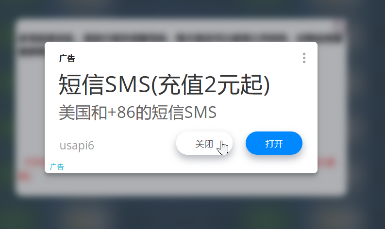

# 过去可能采用过的其他代码

代码中还有一些注释掉的内容或不导通的branch，应该是过去使用的手段，这里也列出


## 诱导用户次日继续点击

用户完成任务后，不提供服务，要如何留住用户呢？
弹出“次数已达上限”提示，欺骗用户次日继续点击


```js
$(".getSmsBtn3").text("验证成功");
$(".getSmsBtn3").css("background-color", "green");
$(".getSmsBtn3").css("border-color", "green");
alert(`该${classText}今日使用次数已超限，请次日再抢先${alertText}（非凌晨时间）！`)
```

## 诱导用户使用悟空浏览器

```js
$('.textShow2').css('display', 'none'); 
$('.textShow3').css('display', 'block'); 
$('.class3').css('display', 'block');
```

 ```html
<div class='textShow3' style="text-align: center;padding-top: 10px;display:none"><span style="color: red;padding: 10px;" data-class="2"">前往 悟空浏览器APP 搜索："马桶资源" ，步骤如下图所示，找到马桶资源文件夹下的第一集视频，找到当前视频进度位置，墙上打码的就是三级${classText}(注意：每天更换)</span></div>
 ```

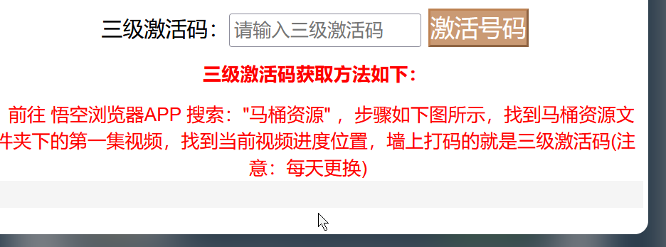

## 其他网盘代码

还有其他网盘代码，从注释掉的内容看，包括UC盘，迅雷，快兔网盘，360云盘，百度盘，夸克盘

```js
function goPan(element) {
    var nameValue = element.getAttribute('data-class');

    let userAgent = navigator.userAgent;
    let isMobile = /Android|webOS|iPhone|iPad|iPod|BlackBerry|IEMobile|Opera Mini/i.test(userAgent);
    let wheel = localStorage.getItem('wheel');
    // if (isMobile && !wheel) {
        if (true) {
        clearTimeout(setTime)
        if (!localStorage.getItem('ck')) {
            fetch('/tj?tj=1')
            localStorage.setItem("ck", 1);
        }
        if (nameValue == 1) {
            // UC
            // window.open('https://drive.uc.cn/s/4b9f6462a5914', '_blank');
            // window.open('https://drive.uc.cn/s/10af3add3dae4', '_blank');
            // window.open('https://drive.uc.cn/s/39bd98f5c3224', '_blank');
            // window.open('https://pan.xunlei.com/s/VORjQPqLddp-cf7WskG2BvI2A1?pwd=c87f', '_blank'); Sue
            window.open('https://pan.xunlei.com/s/VOU5gOBHEjxtJcybWAlyxUZiA1?pwd=qgxz', '_blank');
            // window.open('https://wap.diskyun.com/s/sDiSxZXIBJaTQC4koc07', '_blank');
            
        } else if (nameValue == 2) {
            // xunlei
            // window.open('https://pan.xunlei.com/s/VNuvpPFRzxCVmPlfOOZBI_ScA1?pwd=rkz4#', '_blank');

            $('.textShow2').css('display', 'block'); 
            // bai
            // window.open('https://pan.xunlei.com/s/VOU5gOBHEjxtJcybWAlyxUZiA1?pwd=qgxz', '_blank');
            // 360
            // window.open('https://www.yunpan.com/surl_y9jn2DtJFex', '_blank');
            
            window.open('https://pan.baidu.com/s/1RsP5zJDQpp-c952ebGx3Cg?pwd=1234', '_blank');
            
            
        } else if (nameValue == 3) {
            // kuake
            window.open('https://pan.quark.cn/s/5439deddab63', '_blank');
        }

    } else {
        alert('请使用手机浏览器领取！');
    }
}
```

